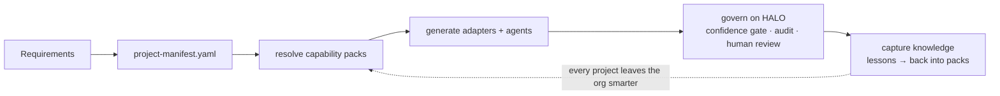

# Enterprise Engineering Intelligence Kit (EEIK) Bootstrap


-orange)


> A ready-to-fork seed **and** an installable, governed generation engine that gives **8 AI coding
> tools** — Claude Code, GitHub Copilot, Kiro, Codex CLI, Cursor, Gemini CLI, Windsurf, Cline — the enterprise context to
> act as specialist engineers from day one.

**📖 New to EEIK? Start with the [visual overview](docs/index.html)** — the fastest way to see what it is
(open it in a browser). Then follow the Quick Start below, or jump to the
[Engine Reference](docs/reference/engine-reference.md).

## Quick Start

**Adopt the config into your project** (the primary path — copies the *seed* set only, never the engine
or EEIK's own agents):

```bash
pip install -e /path/to/eeik-bootstrap      # install the `eeik` engine once
eeik seed --into . --apply                  # copy adapter shells + shared config into this project
eeik doctor                                 # check your setup (deps, manifest, packs) with a fix per issue
# then: write project-manifest.yaml → `eeik activate --apply` to materialise the packs you selected
```

**Try the engine** (no API key, no cloud):

```bash
pip install -e ".[test]"                    # engine + HALO (agent-harness) + pytest
eeik demo                                   # generate an agent on the real HALO confidence gate
eeik catalog --tag regulated                # query the 25-pack capability catalog
eeik architectures                          # 5 proven, deployable reference architectures
```



## Who is this for?

| You are… | EEIK gives you… |
|---|---|
| **A team adopting AI tools** | One config, eight tools speaking your standards — `eeik seed` into any repo |
| **A platform / enablement team** | A governed engine: versioned packs, drift detection, conformance gates |
| **A product that generates artifacts** (e.g. APEX) | A stable SDK + MCP surface to validate manifests, resolve packs, and govern generation — see the [versioned integration contract](docs/reference/apex-integration-contract.md) |
| **A regulated enterprise** | Domain packs (banking/insurance/healthcare/retail), governance reviews, HALO-governed generation |

---

A ready-to-fork seed repository that gives **8 AI coding tools** — Claude Code, GitHub Copilot, Kiro, Codex CLI, Cursor, Gemini CLI, Windsurf, and Cline — the enterprise context they need to act as specialist engineers from day one.

EEIK transforms AI coding assistants from generic code generators into context-aware engineering partners that understand:

- Technology stacks
- Enterprise standards
- Architecture governance
- Modernization programs
- Delivery processes
- Cloud platforms
- AI engineering patterns
- Organizational knowledge

Drop the configuration layers from this repository into any project and all 8 AI tools become engineering assistants that understand your ecosystem from day one.

EEIK is not a runnable application.

It is an AI-native engineering operating system.

---

## Vision

Most organizations repeatedly rebuild the same engineering knowledge:

Coding standards
Architecture patterns
Governance processes
Migration approaches
Estimation models
Review checklists
Delivery workflows

EEIK captures this knowledge once and makes it reusable across every project.

The long-term goal is:

``` text
Project Requirements
            ↓
      EEIK Bootstrap
            ↓
 Capability Resolution
            ↓
 Repository Generation
            ↓
 Agent Generation
            ↓
 Governed Delivery
            ↓
 Knowledge Capture
            ↓
 Organizational Learning
```
Every project should leave the organization smarter than it was before the project started.

---

## What EEIK Provides
EEIK combines:

### AI Configuration Layer
For all 8 AI tools:
- **Claude Code** — `.claude/` (44 agents, 19 commands, hooks, memory)
- **GitHub Copilot** — `.github/` (44 agents, instructions, prompts, workflows)
- **Kiro** — `.kiro/steering/` (always-on steering docs)
- **Codex CLI** — `AGENTS.md` + 5 subdirectory `AGENTS.md` templates
- **Cursor** — `.cursor/rules/` (glob-matched `.mdc` rules)
- **Gemini CLI** — `GEMINI.md` (persistent project context)
- **Windsurf** — `.windsurf/rules/` (always-on Cascade rules)
- **Cline** — `.clinerules/` (persistent workspace rules)

### Capability Layer
Reusable engineering intelligence:
- Architecture
- Java
- Angular
- AWS
- AI Engineering
- Modernization
- Governance
- Operations
- Delivery

### Knowledge Layer
Reusable:
- Reference architectures
- ADRs
- Patterns
- Lessons learned
- Incident learnings
- Migration strategies

### Governance Layer
Built-in:
- Architecture reviews
- Security reviews
- AI reviews
- Production readiness reviews

### Generation Layer — a governed engine (v1.4)
EEIK's generators are agents. As of v1.4 they run **on HALO** (`agent-harness`), the ecosystem's
governed agent runtime — not ungoverned `claude --print`:
- Repository Generator, Agent Factory, Capability Resolver, Knowledge Platform
- Every generation flows through the **confidence gate**, is **audited**, and — because generation is
  **SUGGEST authority** — is **routed to human review**, never auto-applied (gate rule G-5). It **fails
  safe** when HALO is absent. See [ADR-003](docs/decisions/ADR-003-eeik-generators-run-on-halo.md).
- Capability packs are **versioned dependencies**: `eeik lock` pins them to `eeik.lock`, `eeik diff`
  detects drift, `eeik upgrade` re-pins. See [ADR-004](docs/decisions/ADR-004-capability-pack-versioning-and-lockfile.md).

> **Posture:** EEIK becomes a governed generation *engine*, not a competing product platform — APEX is
> the runnable AI-SDLC product and *consumes* EEIK for onboarding. See [ROADMAP.md](ROADMAP.md#platform-posture--engine-not-product).

---

## EEIK in Action — the Governed Generation Engine

> **Surface reference:** every CLI command, SDK function, and MCP tool — plus MCP production notes and
> the "what works offline" table — lives in
> [docs/reference/engine-reference.md](docs/reference/engine-reference.md).

<details>
<summary><strong>Full engine walkthrough</strong> — demo · lock/drift · catalog · verify · contracts · architectures · MCP · SDK (click to expand)</summary>

```bash
pip install -e ".[test]"                        # the eeik engine + HALO (agent-harness) + pytest
eeik demo                                       # generate an agent on the REAL HALO gate — no API key
```
```text
EEIK Governed Generation  ·  generator: agent-generator
  authority SUGGEST   action SUGGEST   confidence 0.72
  gate → auto_enforced: False  (G-5: SUGGEST never auto-enforces)
  bypass counter: 0  (must be 0)
  → routed to human review  reason=suggest  sla=14400s
  audit: human-review  "eeik-agent-generator produced a draft artifact (307 chars) for human review."
  ✓ Draft staged for approval: .eeik-staging/agent-generator/artifact.md
```

Versioned adoption + drift detection (the fix for copy-once rot):

```bash
eeik lock                                       # pin adopted pack versions → eeik.lock
eeik diff --exit-code                           # later: report drift from upstream (CI gate, exits 2)
python3 -m pytest tests/ -q                     # 11 tests: versioning, drift, catalog, HALO governance
```

Query the capability catalog — a machine-readable registry of every pack, agent, and standard:

```bash
eeik catalog --tag regulated                    # packs tagged 'regulated' (banking, healthcare, …)
eeik catalog --query fhir                       # free-text match across name / description / tags
eeik catalog --provides java-architect          # which pack provides that agent
eeik catalog --json                             # the read model the EEIK MCP server exposes
```

Run the conformance gate — do packs actually deliver what they declare? (closes the loop:
generate → govern → **verify**):

```bash
eeik verify                                     # fail / warn / pass report
eeik verify --exit-code                         # CI gate: non-zero on hard failures
eeik verify --strict --exit-code                # also fail on warnings (clean today)
```

New to EEIK? Run **`eeik doctor`** — it diagnoses common adoption/health problems (Python + deps, HALO
and MCP availability, manifest validity, pack resolution, adapter materialisation, lock drift, and the
conformance gate) and prints an actionable fix for each. It never throws:

```bash
eeik doctor                                     # health report with a fix per problem
eeik doctor --exit-code                         # non-zero on any FAIL (setup gate)
eeik doctor --json                              # machine-readable (same on the SDK / MCP)
```

Emit a **HALO Agent Contract** for a generated agent — runtime-governed by construction (the archetype
fixes the authority ceiling, capabilities, gate threshold, and tool allowlist; validated by HALO's own
schema). Closes the chain: EEIK generates against **HALO's** Agent Contract schema → HALO runs it
([ADR-009](docs/decisions/ADR-009-agent-generator-emits-halo-contracts.md)):

```bash
eeik contract --blueprint auditor  --name compliance-officer --validate   # → BLOCK authority, gate 0.95
eeik contract --blueprint reviewer --name java-reviewer --param language=java --validate
```

Browse **reference architectures** — proven blueprints, each with a schema-valid manifest you can feed
straight to `resolve-packs` / the repository-generator; `eeik verify` keeps them conformant
([ADR-010](docs/decisions/ADR-010-reference-architectures-engine-surfaced.md)):

```bash
eeik architectures                       # order-management · ai-augmented-service · data-platform · multi-tenant-saas
eeik architectures data-platform         # stack, components, and the packs it resolves to
```

> **Repository layout:** see [ARCHITECTURE.md](ARCHITECTURE.md) for the four-layer taxonomy (engine /
> content / adapters / docs) and the "where does a new X go?" placement rule ([ADR-005](docs/decisions/ADR-005-layered-directory-taxonomy.md)).

Serve the engine's read model over **MCP** — any MCP host (Claude Code, an APEX agent, an IDE) can then
call EEIK live instead of copying static adapter files ([ADR-006](docs/decisions/ADR-006-eeik-mcp-server.md)):

```bash
pip install -e ".[mcp]"     # the MCP SDK is an optional extra
eeik mcp                    # read: eeik_catalog, eeik_validate_manifest, eeik_resolve_packs, eeik_pack_drift,
                            #       eeik_verify, eeik_reference_architectures, eeik_doctor, eeik_lint
                            # governed write: eeik_generate, eeik_capture_lessons → STAGED, human-review
                            #                 drafts (never auto-applied)
```

Register it with a host — e.g. Claude Code `.mcp.json`:

```json
{ "mcpServers": { "eeik": { "command": "eeik", "args": ["mcp"] } } }
```

Or consume EEIK **in-process** as a library — the typed SDK, the same read model without a subprocess
or a protocol ([ADR-007](docs/decisions/ADR-007-eeik-public-python-sdk.md)):

```python
import eeik

result = eeik.validate_manifest(path="project-manifest.yaml")   # ValidationResult(valid, errors, warnings)
packs  = eeik.resolve_packs(manifest=doc)                        # ["core", "architecture", "java", ...] (pulls in pack dependencies)
clashes = eeik.pack_conflicts(manifest=doc)                      # [] — declared conflicts among resolved packs
banking = eeik.find_packs(tag="banking")                         # [Pack(...), ...]
who    = eeik.providers_of("java-architect")                     # [Provider(pack="java", kind="agent")]
draft  = eeik.generate("agent-generator", spec="a refund agent") # GenerationOutcome — staged, auto_enforced=False
prev   = eeik.generate("agent-generator", spec="…", preview=True) # governed but not persisted (staged=False)
lessons = eeik.capture_lessons(audit_records)                    # closed loop: audit → staged LL-NNN drafts
health = eeik.doctor()                                           # DoctorReport(healthy, counts, diagnostics+fixes)
content = eeik.lint()                                            # LintReport — agent/standard content well-formedness
```

The CLI, the MCP server, and this SDK are three surfaces over **one** implementation — they cannot drift.

This is the same runtime, gate, and audit that APEX uses for its SDLC phase agents — EEIK now dogfoods
the `agent-harness` capability pack it ships to everyone else.

</details>

---

## Repository Structure

```
── AI Tool Adapters (root — read by each tool automatically) ─────────────────
CLAUDE.md          ⚠️  This is EEIK's own brief — DO NOT copy to target projects
                       Use templates/PROJECT-CLAUDE.md instead
AGENTS.md          Codex CLI root context
GEMINI.md          Gemini CLI persistent context
CONTRIBUTING.md    Contribution guide
SECURITY.md        Vulnerability reporting

── Tool-Specific Config ──────────────────────────────────────────────────────
.claude/           Claude Code  — 44 agents, 19 commands, hooks, memory, standards
.github/           Copilot      — 44 agents, instructions, prompts, workflows, hooks
.kiro/             Kiro         — steering docs (product, tech, structure), hooks
.cursor/           Cursor       — .mdc rules (golden-rules, architecture, security)
.windsurf/         Windsurf     — always-on Cascade rules (golden-rules, tech)
.clinerules/       Cline        — persistent workspace rules (golden-rules, project)

── Intelligence Layer (tool-agnostic) ────────────────────────────────────────
capability-packs/  22 packs — core, architecture, java, aws, ai-engineering,
                   agent-harness, governance, angular, react, data-engineering,
                   python, openshift, containers, delivery, modernization,
                   insurance, banking, belgium-insurance, healthcare
templates/         PROJECT-CLAUDE.md  ← use this as CLAUDE.md in target projects
                   Code templates per technology domain

── Generators ────────────────────────────────────────────────────────────────
generators/        adapter-generator  — Kiro/Codex/Cursor/Gemini adapter templates
                     codex-subdirs/   — 5 subdirectory AGENTS.md templates
                   repository-generator, agent-generator, capability-selector,
                   knowledge-generator, governance-generator, model-router,
                   project-analyzer
bootstrap/         /bootstrap command: manifests, schemas, validators, resolvers

── Engine (installable Python package) ───────────────────────────────────────
pyproject.toml     `pip install -e .` → the `eeik` console script (also `python -m eeik`)
eeik/              cli.py       — CLI entry point
                   manifest.py  — JSON Schema + 8 governance rules (no AI needed)
                   packs.py     — manifest → .claude/ materialisation
                   adapters.py  — generate all 6 AI tool adapters
                   runner.py    — run generators (add --governed for the HALO gate)
                   generation.py— HALO-governed generation seam (gate + audit + review)
                   versions.py  — pack versions + content digests
                   lock.py      — eeik.lock lockfile + drift detection (lock/diff/upgrade)
                   schemas/manifest.schema.json — the single canonical manifest schema
scripts/           *.py         — backward-compatible shims → the eeik package
tests/             test_engine.py — versioning, drift, and HALO-governance tests

── CI/CD ─────────────────────────────────────────────────────────────────────
.github/workflows/ eeik-validate.yml   — manifest + agent lint on PR
                   eeik-adapt.yml      — auto-regenerate adapters on manifest change

── Documentation ─────────────────────────────────────────────────────────────
docs/
├── index.html         Interactive visual guide — open in browser for the full overview
├── specs/             Internal design specs
├── concepts/          Vision, architecture, AI governance
├── reference/         Roadmap, inventory, platform capabilities
└── getting-started/   Adoption guide, use cases
```

---

## EEIK Architecture
```
                    ┌──────────────────┐
                    │    Bootstrap     │
                    └─────────┬────────┘
                              │
                              ▼
                 ┌────────────────────────┐
                 │ Capability Resolution  │
                 └─────────┬──────────────┘
                           │
                           ▼
             ┌───────────────────────────────┐
             │ Selected Capability Packs     │
             └─────────┬─────────────────────┘
                       │
        ┌──────────────┼──────────────┐
        ▼              ▼              ▼

   Repository      Agent         Governance
   Generator       Factory       Engine

        ▼              ▼              ▼

   Generated      Generated      Reviews
 Repository        Agents

                       ▼

              Knowledge Platform
```

---

## Supported Technology Domains

| Domain | Stack |
|--------|-------|
| **Legacy Java** | Spring 4.x/5.x, Spring MVC, JdbcTemplate, JUnit 4, Maven |
| **Modern Java** | Spring Boot 3.x, Java 17/21, `jakarta.*`, Spring Data JPA, Spring Security 6.x, OpenAPI 3 |
| **Angular** | Angular 17+, Standalone Components, Signals API, NgRx, RxJS 7+, strict TypeScript |
| **Mainframe** | IBM COBOL 6.x, HLASM, JCL, CICS, DB2 z/OS |
| **IBM i** | RPG IV, RPGLE (ILE), CL, DDS, DB2 for i |
| **AWS** | CDK TypeScript, Terraform HCL, ECS Fargate, EKS, Lambda, RDS Aurora, SageMaker, Bedrock |
| **Data / ML / AI** | SageMaker Pipelines, Bedrock, LangChain, LangGraph, RAG, MLOps |
| **Agentic AI** | LangGraph, CrewAI, AutoGen, MCP, Agent-to-Agent (A2A) protocols |
| **Platform** | Docker, Kubernetes, GitHub Actions, CloudWatch, X-Ray |

---

## EEIK Capability Packs
EEIK separates reusable engineering intelligence into capability packs.

Examples:
```
capability-packs/       (22 packs)
├── core/               foundational agents, golden rules, security/observability baselines
├── architecture/       enterprise-architect, arb-reviewer, reference architectures
├── java/               java-architect, spring-security-engineer, testcontainers patterns
├── aws/                cdk-engineer, bedrock-rag-patterns, eventbridge-patterns
├── ai-engineering/     ai-architect, rag-specialist, llm-evaluation-patterns, vector-db-selection
├── agent-harness/      agent-harness-protocol conformance → runtime doubts-suplab/agent-harness
├── governance/         compliance-reviewer, production-readiness-reviewer, GDPR/SOC2/PCI
├── angular/            angular-developer, signals migration guide
├── react/              react-developer (Next.js 14, Server Components, TanStack Query)
├── data-engineering/   data-engineer, lakehouse-patterns (Spark/Glue/Kafka/dbt)
├── python/             fastapi-engineer, python-developer
├── openshift/          openshift-engineer, SCC patterns
├── containers/         dockerfile-standard
├── delivery/           branching-standard, Conventional Commits
├── modernization/      ibmi-modernization-expert, cobol-standard, strangler-fig
├── insurance/          claims-processing-patterns, insurance-domain-glossary
├── banking/            swift-iso20022-patterns, banking-compliance-standard
├── belgium-insurance/  belgium-insurance-expert, Branch 21/23/26, FSMA/NBB, TOB
└── healthcare/         hl7-fhir-patterns, healthcare-compliance-standard
```

Each pack may contain:
- Standards
- Templates
- Prompts
- Workflows
- Knowledge assets
- Review criteria


## How to Adopt This Bootstrap

### 1. Create your project and copy the config layers

```bash
mkdir my-new-service && cd my-new-service
git init

EEIK=/path/to/eeik_bootstrap   # set this to where you cloned EEIK
```

**Recommended — `eeik seed`.** EEIK's root dirs are dual-purpose (EEIK's own config *and* the seed you
copy). `eeik seed` copies exactly the right subset — no engine, no tests, no EEIK's own agents, and it
plants `templates/PROJECT-CLAUDE.md` as your `CLAUDE.md` (never EEIK's root one) automatically (ADR-011):

```bash
pip install -e $EEIK             # installs the `eeik` engine once
eeik seed --list                 # see what's seed / generated / engine
eeik seed --into . --apply       # copy the seed set into this project
```

**Or by hand** — the classic `cp -r`. Copy only the adapter shells, and mind the CLAUDE.md footgun:

```bash
cp -r $EEIK/.github/instructions ./.github/instructions
cp -r $EEIK/.vscode              ./.vscode

# ⚠️  IMPORTANT: use templates/PROJECT-CLAUDE.md — NOT CLAUDE.md from the EEIK root.
# EEIK's CLAUDE.md describes the EEIK repo itself (bootstrap/, generators/, capability-packs/).
# Claude Code reads it and thinks it's inside EEIK, causing artifacts to be created there.
cp    $EEIK/templates/PROJECT-CLAUDE.md ./CLAUDE.md
```

The `.claude/` agents, `.kiro/`, `.cursor/`, `AGENTS.md`, and `GEMINI.md` are **generated** — don't copy
EEIK's; regenerate them from *your* manifest in step 2.

### 2. Validate and generate adapters

```bash
pip install -e $EEIK        # installs the `eeik` engine once

# Validate your manifest (optional — create project-manifest.yaml from bootstrap/manifests/manifest-template.yaml first)
eeik validate project-manifest.yaml

# Regenerate all 6 AI tool adapters from your manifest
eeik generate-adapters --apply

# Materialise capability pack agents + standards into .claude/
eeik activate --apply
```

### 3. Fill in project context

Edit `.claude/memory/project-context.md` — this is what every agent reads at session start:

- Service name and purpose
- Environment URLs and AWS account IDs
- Auth patterns (Cognito, IAM roles)
- Database engine and schema name

### 4. Adjust GitHub Copilot glob patterns

Each file in `.github/instructions/` has an `applyTo` frontmatter. Update to match your source layout:

```markdown
---
applyTo: "src/main/java/com/yourcompany/**/*.java"
---
```

### 5. Remove unused domains

Delete agents and instructions for domains not in your stack — lean context = sharper agents.

### 6. Open Claude Code in your new project (not in EEIK)

```bash
cd my-new-service   # ← must be here, not in EEIK
claude

# Smoke-test:
/estimate "implement POST /orders endpoint with idempotency key"
```

---

## Agent Catalogue (44 agents per layer)

Full catalogue with descriptions: **`AGENTS.md`** at the repository root.

### GitHub Copilot Agents — select via `@` in Copilot Chat

| Domain | Agents |
|--------|--------|
| Java | `java-dev`, `java-tech-lead`, `java-tester`, `jacoco-coverage-tester`, `developer` |
| Angular | `angular-dev`, `angular-tester`, `angular-coverage-checker` |
| Architecture | `architect`, `enterprise-architect`, `aws-architect`, `arb-reviewer` |
| Cloud / Infra | `cdk-terraform-helper`, `aws-deploy-helper`, `local-deploy-helper`, `containerisation-helper`, `ci-engineer`, `devsecops-engineer` |
| Quality | `reviewer`, `security-auditor`, `performance-reviewer`, `coverage-enforcer`, `test-quality-enforcer`, `tester` |
| Data / ML / AI | `data-scientist-aws`, `ml-engineer-aws`, `ai-engineer-aws`, `mlops-engineer`, `ai-governance-officer` |
| Agentic AI | `langraph-engineer`, `crewai-engineer`, `autogen-engineer`, `mcp-engineer`, `a2a-engineer` |
| Modernisation | `modernization-expert`, `ibmi-modernization-expert` |
| Delivery / Ops | `estimator`, `project-tracker`, `ops-engineer`, `sre-engineer`, `incident-handler`, `rca-agent` |
| Docs | `analyst`, `technical-writer` |

### Claude Code Agents — auto-selected by task context

Same 44 domains; invoke explicitly: *"Using the `java-developer` agent, implement the OrderService"*

---

## Instruction Files (29 — Auto-Applied by File Type)

| File | Applies To |
|------|-----------|
| `spring-boot.instructions.md` | `**/src/main/java/**/*.java` |
| `java-legacy.instructions.md` | Legacy Spring 4/5 Java files |
| `java-quality.instructions.md` | Java code quality and test coverage |
| `angular.instructions.md` | `**/*.ts`, `**/*.html`, `**/*.scss` |
| `mainframe.instructions.md` | `**/*.cbl`, `**/*.asm`, `**/*.jcl` |
| `mainframe-extended.instructions.md` | Extended COBOL/JCL patterns |
| `ibmi.instructions.md` | `**/*.rpgle`, `**/*.clle`, `**/*.dds` |
| `sql.instructions.md` | `**/*.sql`, MyBatis mapper XML |
| `test.instructions.md` | `**/*Test.java`, `**/*.spec.ts` |
| `aws-architecture.instructions.md` | `**/*.tf`, `**/cdk/**/*.ts` |
| `aws-data-ml-ai.instructions.md` | `**/*.ipynb`, `**/sagemaker/**` |
| `cdk-terraform.instructions.md` | CDK stacks and Terraform modules |
| `containerisation.instructions.md` | Dockerfiles, docker-compose, K8s manifests |
| `cicd.instructions.md` | `.github/workflows/**`, Jenkinsfile |
| `deployment.instructions.md` | Deployment scripts |
| `enterprise-architecture.instructions.md` | `**/architecture/**`, `**/adr/**` |
| `architecture-governance.instructions.md` | ARB reviews and standards compliance |
| `devsecops.instructions.md` | Security pipeline configuration |
| `incident-ops.instructions.md` | `**/runbooks/**`, `**/incidents/**` |
| `project-estimation.instructions.md` | `**/estimates/**`, `**/*.estimate.md` |
| `ai-governance.instructions.md` | AI system governance artefacts |
| `langgraph.instructions.md` | LangGraph agent graph code |
| `crewai.instructions.md` | CrewAI multi-agent code |
| `autogen.instructions.md` | Microsoft AutoGen code |
| `mcp-protocol.instructions.md` | MCP server/client code |
| `a2a-protocol.instructions.md` | Agent-to-Agent communication code |
| `mlops-pipeline.instructions.md` | MLOps pipeline code |
| `sre.instructions.md` | SLO definitions and runbooks |
| `memory-architecture.instructions.md` | `.claude/memory/**` files |

---

## Skills (12 — Auto-Loaded by GitHub Copilot)

| Skill | Triggers When |
|-------|--------------|
| `estimation` | Estimating effort, sizing stories, planning delivery |
| `jacoco-analysis` | JaCoCo reports, coverage thresholds, missed branches |
| `aws-cdk-deploy` | CDK deploy, diff, or rollback |
| `incident-response` | Declaring or managing a P1/P2 incident |
| `code-quality-scan` | SonarQube, SpotBugs, OWASP findings |
| `ai-governance` | AI system governance reviews and model cards |
| `architecture-governance` | ARB gate reviews and standards compliance |
| `devsecops` | Security pipeline configuration and gate setup |
| `langgraph-patterns` | LangGraph graph design and state machines |
| `mcp-server-design` | MCP server and tool schema design |
| `mlops-pipeline` | MLOps pipelines, model registry, drift monitoring |
| `sre-practices` | SLI/SLO definition and error budget management |

---

## Orchestrated Workflows (14)

Reference in Copilot Chat with `#file:.github/prompts/workflows/<name>.prompt.md`:

| Workflow | Description |
|---------|-------------|
| `full-feature-dev` | Analyst → Architect → Developer → Tester → Coverage → Reviewer |
| `pr-review-workflow` | Code → Security → Performance → Test Quality |
| `tdd-cycle` | Red → Green → Refactor → Coverage |
| `cobol-to-java-workflow` | COBOL modernisation pipeline |
| `aws-infra-deploy` | Architect → CDK → CI/CD → Deploy → Ops |
| `incident-rca-workflow` | Detection → Triage → War Room → Resolution → RCA |
| `arb-review-workflow` | Formal ARB gate review |
| `ai-governance-review` | AI system classification → Model Card → Risk Assessment → Sign-Off |
| `multi-agent-system-design` | Problem Decomposition → Topology → State → Implement |
| `mcp-server-development` | Capability Design → Security → Schema → Implement |
| `ibmi-to-cloud-workflow` | IBM i Discovery → Architecture → Phased Migration → Cutover |
| `devsecops-pipeline-review` | Audit → Gap Analysis → Remediate → Validate |
| `game-day-exercise` | Hypothesis → Baseline → Inject → Observe → Report |
| `ml-model-delivery` | Experiment → Governance → MLOps → Deploy → Monitor |

---

## Task Prompts (22)

Reference with `#file:.github/prompts/tasks/<name>.prompt.md`:

| Prompt | Action |
|--------|--------|
| `generate-unit-tests` | JUnit 5 / Jasmine test class |
| `generate-integration-tests` | Spring Boot + Testcontainers |
| `generate-rest-api` | Controller + service + DTO + OpenAPI |
| `generate-angular-component` | Standalone component + spec |
| `generate-angular-service` | HttpClient service + spec |
| `generate-mapstruct-mapper` | MapStruct interface |
| `generate-openapi-spec` | OpenAPI 3.0 YAML spec |
| `add-javadoc` | Complete Javadoc on all public members |
| `add-logging` | SLF4J at correct levels throughout |
| `code-review` | Structured single-class review |
| `explain-code` | Plain-English explanation |
| `explain-mainframe-program` | COBOL/JCL/Assembler walkthrough |
| `explain-rpg-program` | IBM i RPG IV / RPGLE analysis |
| `refactor-to-clean-code` | SOLID / clean code refactor |
| `modernize-cobol-to-java` | COBOL → Java with risk matrix |
| `modernize-rpg-to-java` | RPG → Java migration |
| `write-adr` | Architecture Decision Record scaffold |
| `write-rfc` | Request for Comments document |
| `write-model-card` | AI/ML model card |
| `ai-risk-assessment` | EU AI Act + GDPR risk assessment |
| `define-sli-slo` | SLI/SLO definition with error budget |
| `update-project-memory` | Update `.claude/memory/` files |

---

## Claude Code Slash Commands (19) — Claude Code only

> Slash commands live in `.claude/commands/` and work **only in Claude Code**. Kiro, Codex CLI, Cursor, and Gemini CLI use steering docs and rules files instead.

| Command | Description |
|---------|-------------|
| `/bootstrap` | Interactive project discovery → generates `project-manifest.yaml` |
| `/validate-manifest` | Validate manifest against JSON Schema + 8 governance rules |
| `/generate-repo` | Full repository scaffold from manifest (9-step) |
| `/generate-agent --blueprint <type>` | Generate project-specific agent from 8 blueprints |
| `/analyze-project` | Scan existing repo → infer stack → suggest packs |
| `/estimate "feature"` | P50/P80/P90 effort estimate using 6.4h/day formula |
| `/review` | Full PR review: correctness, security, performance, quality |
| `/adr "decision title"` | Scaffold Architecture Decision Record |
| `/create-adr "title"` | Full ADR with context, decision, consequences, alternatives |
| `/create-rfc "title"` | RFC for significant decisions requiring team review |
| `/rca "symptoms"` | Blameless 5-Whys root cause analysis |
| `/incident "P1, service: X"` | Declare and coordinate an incident |
| `/capture-incident "title"` | Capture incident learnings into memory |
| `/capture-lesson "lesson"` | Capture pattern or lesson into memory |
| `/security-scan [path]` | OWASP Top 10 review + secrets scan |
| `/deploy-check "env: X"` | Pre-deployment readiness checklist (24-point) |
| `/coverage-report [path]` | JaCoCo/Istanbul gap analysis + targeted test stubs |
| `/memory-update "what changed"` | Update `.claude/memory/` persistent context |
| `/sync-docs [path]` | Validate API docs against OpenAPI spec |

---

## Claude Code Memory Files

`.claude/memory/` files are read at session start — no re-explaining the project on every session:

| File | Purpose |
|------|---------|
| `project-context.md` | **Fill this in** — service inventory, environments, auth patterns |
| `domain-glossary.md` | Business term definitions for this domain |
| `decisions.md` | Lightweight architecture decision log |
| `constraints.md` | Hard constraints that must never be violated |
| `patterns.md` | Approved patterns and forbidden anti-patterns |
| `tech-debt.md` | Prioritised tech debt register |
| `rca-tracker.md` | Incident/RCA status and corrective action tracking |
| `session-log.md` | Auto-updated by `on-stop.sh` hook |
| `rejected-approaches.md` | Tried-and-rejected solutions |

---

## Coding Standards

`.claude/standards/` provides the mandatory rules agents read before writing code:

| File | Covers |
|------|--------|
| `java.md` | Spring Boot 3.x, constructor injection, SLF4J, jakarta.*, JUnit 5 |
| `angular.md` | Standalone components, signals, OnPush, reactive forms |
| `aws.md` | IAM least privilege, encryption, CDK patterns, tagging |
| `sql.md` | No SELECT *, parameterised queries, Flyway conventions |
| `testing.md` | JUnit 5/AssertJ/Mockito, Jasmine/Karma, AAA pattern, thresholds |
| `cicd.md` | Pipeline stages, quality gates, OIDC auth, artefact promotion |
| `containers.md` | Multi-stage Dockerfiles, non-root users, JVM flags, K8s probes |
| `mainframe.md` | COBOL, RPG, CL, JCL standards and migration guidance |

---

## Estimator Formula

All estimates use:

> **Human Days = Σ Raw Hours ÷ 6.4**
> `6.4 = 8 hours/day × 80% efficiency`

| Scenario | Multiplier | Use For |
|----------|------------|---------|
| P50 | ×1.0 | Sprint planning baseline |
| P80 | ×1.3 | Sprint commitment |
| P90 | ×1.6 | Release planning buffer |

---

## Hooks

### GitHub Copilot (`/.github/hooks/`)
| Hook | Events | Output |
|------|--------|--------|
| `session-hooks.json` | sessionStart, sessionEnd, userPromptSubmitted | `.copilot-session.log` |
| `tool-use-hooks.json` | preToolUse, postToolUse, errorOccurred | `.copilot-tool.log` |

### Claude Code (`/.claude/hooks/`)
| Hook | Trigger | Action |
|------|---------|--------|
| `pre-bash-guard.sh` | Before every Bash command | Blocks: force-push, `rm -rf /`, `DROP DATABASE`, `cdk destroy`, AWS terminations |
| `pre-write-guard.sh` | Before every file write | Validates target path safety |
| `post-edit-check.sh` | After every file edit | Post-write validation |
| `on-stop.sh` | Session end | Auto-updates `.claude/memory/session-log.md` |

---

## Adoption Checklist

Before using this bootstrap in a production project:

- [ ] `templates/PROJECT-CLAUDE.md` copied as `CLAUDE.md` (**not** EEIK's root `CLAUDE.md`)
- [ ] `.claude/memory/project-context.md` filled in (services, environments, auth, AWS resources)
- [ ] `applyTo` glob patterns in `.github/instructions/` updated to match project source layout
- [ ] Unused domain files removed (no mainframe → delete mainframe agents/instructions)
- [ ] `eeik validate project-manifest.yaml` passes (`pip install -e .` first)
- [ ] `eeik generate-adapters --apply` run to generate all 6 tool adapters
- [ ] At least one Claude Code slash command tested (`/estimate "hello world feature"`)
- [ ] At least one GitHub Copilot agent invoked (`@java-architect` or `@aws-architect`)
- [ ] Claude Code opened from **inside the project directory**, not from EEIK
- [ ] Golden Rules understood by the team (constructor injection, no secrets, jakarta.*, etc.)

---

## Contributing

1. **File naming:** `<name>.agent.md`, `<name>.instructions.md`, `<name>.prompt.md`
2. **Agent frontmatter:** `name`, `description` (trigger condition), `model`, `tools`
3. **Instruction frontmatter:** `applyTo` glob pattern
4. **Skill frontmatter:** `name`, `description`; folder name must match skill name
5. **Register new agents** in `AGENTS.md` and `CLAUDE.md` agent table
6. **Update TRACKER.md** when adding new files
7. Test each new file: invoke in Copilot Chat and Claude Code, verify persona is correct
