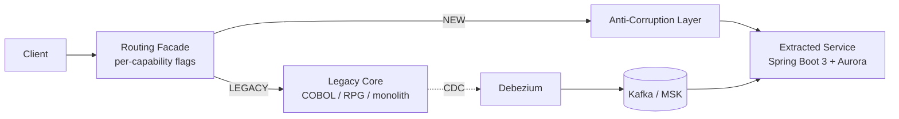

# Legacy Modernization — Strangler Fig

> Incrementally replace a legacy core (mainframe COBOL / IBM i RPG, or a Java monolith) with
> cloud-native services, one capability at a time, without a big-bang cutover.

## Problem

A legacy core still runs the business, but it is expensive to change, hard to staff, and blocks
delivery. A full rewrite is high-risk (long, all-or-nothing, no value until the end). We need a path
that delivers value continuously, keeps the legacy system serving until each slice is proven, and is
reversible at every step.

## Pattern: the strangler fig

A **routing facade** is placed in front of the legacy core. Every request flows through it. For each
business capability the facade holds a route flag:

- `LEGACY` — forward to the legacy core (unchanged behaviour).
- `NEW` — forward to a newly-extracted service.

Capabilities are migrated one at a time: build the new service, run it alongside the legacy path
(coexistence), flip the flag to `NEW`, bake, then retire the legacy path. If the new slice misbehaves,
flip back to `LEGACY` — instant rollback. Over time the new services "strangle" the legacy core until
nothing routes to it and it can be decommissioned.

## Key elements

| Element | Why it matters |
|---|---|
| **Routing facade** | The strangler seam. One place decides legacy-vs-new per capability, so cutover and rollback are configuration, not code deploys. |
| **Anti-corruption layer (ACL)** | Translates the legacy data model / protocols (COPYBOOK, fixed-width, SOAP) into the new service's clean domain model. The legacy shape never leaks inward, so the new service isn't born legacy. |
| **CDC bridge (Debezium → Kafka)** | During coexistence the new service needs current data. Change-data-capture streams legacy changes into its read model, so cutover is a flag flip, not a data-migration outage. |
| **Extracted service** | A migrated bounded context that owns its data (Aurora), exposes REST, and emits domain events. |
| **Feature-flagged cutover** | Migrate → coexist → cut over → bake → retire. Each capability is independently reversible. |

## Migration waves

1. **Seam first** — insert the facade in front of the legacy core with every capability on `LEGACY`
   (no behaviour change; you now have a control point).
2. **Extract a low-risk capability** — build the service + ACL, stand up CDC, run in coexistence.
3. **Cut over** — flip the flag to `NEW`, monitor, bake; roll back on any regression.
4. **Retire** — once proven in production, delete the legacy path for that capability.
5. **Repeat** — highest-value / lowest-risk capabilities first, until the legacy core is empty.

## Governance

Governance profile `standard`, with architecture-review and security-review gates (see
`project-manifest.yaml`). The `modernization` capability pack supplies the `modernization-architect`
and `ibmi-modernization-expert` agents, the `/analyze-legacy`, `/create-migration-wave`, and
`/design-strangler` commands, and the strangler-fig / COBOL standards.

## Deployables

- `cdk/` — the facade + extracted service + Aurora + MSK as AWS infrastructure (CDK v2).
- `local-dev/` — a docker-compose stack (facade + legacy stub + new service + Kafka + Postgres) to run
  the seam and practise a cutover on a laptop.
